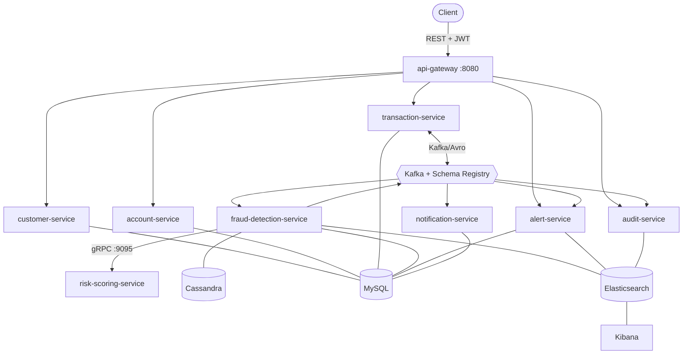

# Fraud Detection Platform

A **real-time financial fraud-detection platform** built as event-driven
microservices — not a CRUD demo. A transaction is accepted in milliseconds, scored
asynchronously by a configurable rule engine augmented with a gRPC risk model, and
every step is idempotent, observable, and secured. When the risk model is unavailable
the platform **degrades to rule-only scoring rather than failing**.

> **Stack:** Java 21 · Spring Boot 4.1.0 · Spring Cloud Gateway · Kafka + Avro (Schema
> Registry) · gRPC/Protobuf · MySQL + Cassandra + Elasticsearch · Resilience4j · JWT ·
> Micrometer + OpenTelemetry · Docker · Kubernetes · OpenShift.

## What it does

- Ingests transactions over a REST API behind a reactive gateway (JWT, RBAC, rate-limiting).
- Scores each one against a **configurable rule engine** (0–29 LOW / 30–59 MEDIUM /
  60–79 HIGH / 80–100 CRITICAL), blended with a synchronous **gRPC risk score**.
- Fans out asynchronously over **Kafka/Avro**: detections → alerts → notifications,
  and **every** domain event → an append-only audit trail.
- Applies the verdict back to the transaction (`ALLOW`→completed / `BLOCK`→rejected /
  `REVIEW`→flagged) — all after an immediate `202 Accepted`.

## Architecture at a glance



Full diagrams and the end-to-end sequence: [`docs/architecture.md`](docs/architecture.md).

### Services

| Service | HTTP | Store | Role |
|---------|------|-------|------|
| api-gateway | 8080 | – | Reactive edge: routing, JWT, rate-limit, correlation-id |
| customer-service | 8081 | MySQL | Auth (JWT issuer), users, customers |
| account-service | 8082 | MySQL | Accounts & balances |
| transaction-service | 8083 | MySQL | Transaction lifecycle, applies verdicts |
| fraud-detection-service | 8084 | MySQL · Cassandra · ES | Features + rule engine + scoring orchestration |
| risk-scoring-service | 8085 (gRPC **9095**) | – | Synchronous ML risk sub-score |
| alert-service | 8086 | MySQL · ES | Alert case management |
| notification-service | 8087 | MySQL | Alert → email/SMS delivery ledger (mock) |
| audit-service | 8088 | ES | Append-only domain-event trail |

### Three communication styles, each chosen deliberately

| Style | Where | Why |
|-------|-------|-----|
| **REST** | client → gateway → services | external API; immediate ack |
| **gRPC/Protobuf** | fraud → risk-scoring (one hop) | a score is needed *inside* the decision; bounded latency |
| **Kafka/Avro** | everything else | decouple, absorb bursts, fan out |

## Quickstart (Docker Compose)

The compose stack **builds all nine service images from source inside a JDK-21 build
container** — so you only need **Docker** on the host, not a local JDK 21.

### Prerequisites

| | Minimum | Why |
|---|---|---|
| Docker | Desktop 4.x+ · Engine 23+ | the service Dockerfiles use BuildKit cache mounts |
| Docker Compose | **v2** (`docker compose version`) | the file uses `condition: service_completed_successfully`; the legacy `docker-compose` binary cannot parse it |
| RAM allocated to Docker | **8 GB** — 12 GB with `--full` | 10 containers + 9 JVMs; below this they are OOM-killed (exit 137) |
| Free disk | ~15 GB | nine service images, six infra images, and the data volumes |

On Docker Desktop, memory lives under **Settings → Resources → Memory**. Nothing else
is required: no host JDK, no Maven, no `cp .env.example .env`.

### Start it

```bash
scripts/up.sh              # Linux · macOS · Git Bash · WSL
```

```powershell
.\scripts\up.ps1           # Windows PowerShell
```

The launcher runs from anywhere in the repo. It verifies the daemon is up, Compose is
v2, Docker has enough memory, and every host port is free — naming the exact fix when
one of those fails — then builds, starts, waits for every container to report healthy,
and prints the endpoint table. Flags: `--full` / `-Full` (add the consoles),
`--no-build` / `-NoBuild`, `--recreate` / `-Recreate`.

Tear down with `scripts/down.sh` (or `.\scripts\down.ps1`); add `--volumes` / `-Volumes`
to wipe the MySQL, Cassandra, Elasticsearch and Kafka data.

Prefer driving Compose yourself? The launchers are a convenience, not a requirement:

```bash
cd deploy/docker
docker compose up -d --build     # 9 image builds + infra; first run takes minutes
docker compose ps                # wait until everything is healthy
```

### Optional consoles

**Kibana** and **Kafka UI** cost roughly 2 GB together and nothing depends on them, so
they sit behind a compose profile and are **off by default**:

```bash
scripts/up.sh --full                                  # or:
cd deploy/docker && docker compose --profile consoles up -d
```

Always started: **Jaeger** `:16686` (traces) · **Schema Registry** `:8090` ·
**Elasticsearch** `:9200`. With the profile: **Kibana** `:5601` · **Kafka UI** `:8100`.
Import the dashboards with `deploy/kibana/import-saved-objects.sh`.

### A port is already in use

Every **host-side** port is overridable. Create `deploy/docker/.env` (copy
`.env.example`) and set just the ones that clash — `scripts/up.sh` tells you which
variable to use for each conflict it finds:

```properties
MYSQL_PORT=13306
GATEWAY_PORT=18080
```

Container-side ports are deliberately fixed: services address each other by container
hostname (`mysql:3306`, `kafka:9092`, `schema-registry:8081`), so an override changes
only what is published on your machine.

### If you cloned before the `.gitattributes` commit

`.gitattributes` pins `mvnw`, `*.sh` and the Dockerfiles to LF. Without it, a clone made
on Windows with `core.autocrlf=true` rewrites them to CRLF, and every image build dies at
`./mvnw: bad interpreter` while MySQL silently skips creating the `fraud_*` schemas. If
your clone predates that commit, renormalize it:

```bash
git pull
git rm --cached -r . && git reset --hard    # re-checkout every file with the new rules
```

The Dockerfiles also strip CRs defensively, so an already-poisoned clone still builds —
but renormalizing is the real fix.

Then authenticate and call the API through the gateway:

```bash
# 1) Get a JWT (dev admin defaults, overridable in deploy/docker/.env)
curl -s localhost:8080/api/v1/auth/login \
  -H 'Content-Type: application/json' \
  -d '{"username":"admin","password":"admin-change-me"}'
# -> {"token":"<JWT>", ...}

# 2) Use it (each service documents its full API at /swagger-ui.html)
#    e.g. transaction-service: http://localhost:8083/swagger-ui.html
curl localhost:8080/api/v1/transactions \
  -H "Authorization: Bearer <JWT>" -H 'Content-Type: application/json' \
  -d '{ ... see Swagger for the schema ... }'
```

Anything not starting? [`docs/troubleshooting.md`](docs/troubleshooting.md) maps the
common symptoms to fixes.

## Build & test (from source)

Requires **JDK 21** and **Maven 3.9+** (enforced mechanically by the build):

```bash
./mvnw clean verify     # compile + unit/slice tests + Testcontainers ITs + coverage
./mvnw clean test       # fast tests only (no Docker)
```

`verify` runs the integration tests (`*IT`) under Failsafe against **real** MySQL /
Elasticsearch / gRPC via Testcontainers, so it needs a **Docker daemon**. See
[`docs/testing.md`](docs/testing.md).

## Repository layout

```
fraud-detection-platform/
├── pom.xml                     # reactor: version policy, Failsafe/JaCoCo, enforcer
├── libs/
│   ├── common                  # JWT, correlation, error handling, constants (shared)
│   ├── avro-schemas            # 8 Kafka event schemas → generated SpecificRecords
│   └── proto-contracts         # risk_scoring.proto → generated gRPC stubs
├── services/                   # the 9 microservices (each: multi-stage Dockerfile)
├── scripts/                    # up/down launchers (sh + ps1), version check
├── deploy/
│   ├── docker/                 # docker-compose stack + .env.example + init scripts
│   ├── k8s/                    # Kubernetes manifests (GA APIs, kustomize)
│   ├── openshift/              # thin overlay on k8s (Route + restricted-v2)
│   └── kibana/                 # saved objects / dashboards
└── docs/                       # the documentation set below
```

## Documentation

| Doc | Covers |
|-----|--------|
| [architecture.md](docs/architecture.md) | Modules, service catalog, end-to-end flow, sync-vs-async, reliability model |
| [kafka.md](docs/kafka.md) | Topics, producers/consumers, DLTs, retries, **idempotency / effectively-once** |
| [avro.md](docs/avro.md) | 8 event schemas, Schema Registry, evolution rules |
| [grpc.md](docs/grpc.md) | `risk_scoring.proto`, server/client, **circuit-breaker degradation** |
| [database.md](docs/database.md) | MySQL (Flyway) · Cassandra (query-first) · Elasticsearch (modern client) |
| [security.md](docs/security.md) | JWT, RBAC, BCrypt, rate limiting, validation, audit, secrets |
| [observability.md](docs/observability.md) | Metrics, tracing, structured logging, correlation IDs |
| [testing.md](docs/testing.md) | Unit/slice + Testcontainers ITs; how to run |
| [kubernetes.md](docs/kubernetes.md) | Manifests, security posture, HPAs, NetworkPolicies |
| [openshift.md](docs/openshift.md) | Route + `restricted-v2` overlay |
| [troubleshooting.md](docs/troubleshooting.md) | Symptom → cause → fix |
| [technology-versions.md](docs/technology-versions.md) | Pinned versions & version policy |
| [PLATFORM-CONVENTIONS.md](docs/PLATFORM-CONVENTIONS.md) | Naming, packages, service registry |

## Design properties

- **Effectively-once** end-to-end: idempotent producers + deterministic event ids +
  consumer-side `processed_events` dedupe + ES docs keyed by `eventId`.
- **Graceful degradation:** Resilience4j circuit-breaker / time-limiter / bulkhead
  around gRPC scoring → automatic rule-only fallback.
- **Reliability:** consumer retries (exponential) → per-topic **`.DLT`**; transactional
  outbox (publish after commit); correlation IDs across REST/gRPC/Kafka.
- **Defence in depth:** the gateway authenticates/authorizes *and* every service
  re-validates the same JWT; method-level RBAC; no committed secrets.
- **Polyglot persistence:** per-service databases, query-first Cassandra, modern typed
  Elasticsearch client (no deprecated HLRC).
- **Observability:** Actuator health/probes, Micrometer→Prometheus, OpenTelemetry
  traces → Jaeger, ECS-JSON structured logs → Elasticsearch → Kibana.

## Status & caveats

- **Runnable via Docker Compose today** (host needs only Docker). A from-source
  `./mvnw clean verify` requires **JDK 21** — the build enforces it, so an older
  toolchain fails fast at the enforcer.
- The bundled infra (MySQL/Cassandra/Kafka/ES/Kibana/Jaeger/OTel) is **single-node
  dev/demo**; for production use operators or managed services and deploy only the app
  workloads. Committed secrets are **dev-only placeholders** — source real ones from a
  secrets manager.
