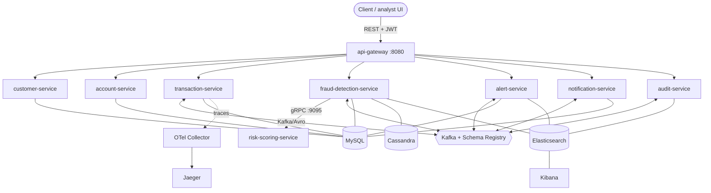
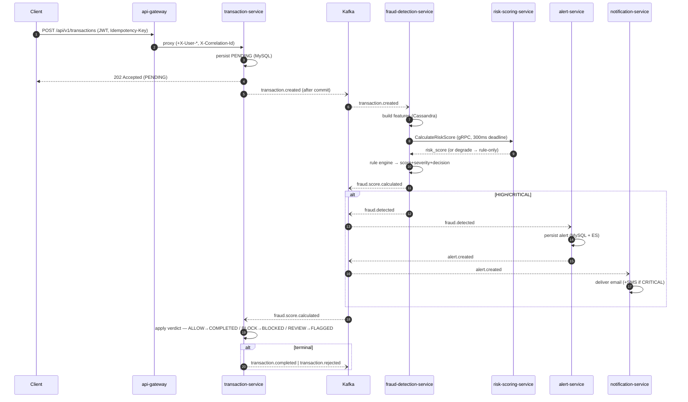

# Architecture

A real-time fraud-detection platform built as **9 Spring Boot 4 / Java 21
microservices** on a Maven multi-module reactor. Services communicate three ways,
each chosen deliberately:

- **REST** — external, client-facing, through the gateway (synchronous).
- **gRPC** — one internal synchronous hop where a decision must block (fraud → risk-scoring). See [`grpc.md`](grpc.md).
- **Kafka + Avro** — all other service-to-service communication, decoupled and asynchronous. See [`kafka.md`](kafka.md), [`avro.md`](avro.md).

## Modules

```
fraud-detection-platform/
├── libs/
│   ├── common          # JWT, correlation, error handling, constants, auto-config — used by all
│   ├── avro-schemas    # 8 event schemas → generated SpecificRecords (Kafka payloads)
│   └── proto-contracts # risk_scoring.proto → generated gRPC stubs
└── services/
    ├── api-gateway              # reactive edge (WebFlux)
    ├── customer-service         # identity/auth (JWT issuer), customers
    ├── account-service          # accounts + balances
    ├── transaction-service      # transaction lifecycle
    ├── fraud-detection-service  # the "brain": features + rules + scoring
    ├── risk-scoring-service     # gRPC-only ML risk sub-score
    ├── alert-service            # alert case management
    ├── notification-service     # alert → email/SMS (mock)
    └── audit-service            # append-only compliance trail
```

Cross-cutting concerns live once in `libs/common` (JWT validation, correlation-id
filters, `GlobalExceptionHandler`, topic/header/role constants, Spring
auto-configuration) and are reused by every service — no duplication.

## Service catalog

| Service | HTTP | gRPC | Stores | Role |
|---------|------|------|--------|------|
| api-gateway | 8080 | – | – | Reactive edge: routing, JWT, rate-limit, correlation-id |
| customer-service | 8081 | – | MySQL `fraud_customer` | Auth (JWT issuer), users, customer profiles |
| account-service | 8082 | – | MySQL `fraud_account` | Accounts, balance movements, freeze |
| transaction-service | 8083 | – | MySQL `fraud_transaction` | Transaction lifecycle, applies verdicts |
| fraud-detection-service | 8084 | client | MySQL `fraud_detection` + Cassandra + ES | Features, rule engine, scoring orchestration |
| risk-scoring-service | 8085 | **9095** | – (stateless) | Synchronous ML risk sub-score (gRPC) |
| alert-service | 8086 | – | MySQL `fraud_alert` + ES | Alert case management |
| notification-service | 8087 | – | MySQL `fraud_notification` | Alert → email/SMS delivery ledger (mock) |
| audit-service | 8088 | – | ES `audit-events` | Append-only domain-event trail |

## System context



risk-scoring-service is intentionally **not** routed through the gateway — it's
gRPC-only and reachable only from fraud-detection-service inside the cluster.

## End-to-end transaction flow

The path a single transaction takes — one synchronous REST hop in, one synchronous
gRPC hop for scoring, everything else asynchronous over Kafka:



**Verdict → outcome:** `ALLOW` → `COMPLETED` (+`transaction.completed`), `BLOCK` →
`BLOCKED` (+`transaction.rejected`), `REVIEW` → `FLAGGED` (no event). The
`POST` returns `202`/PENDING immediately; the final state is reached
asynchronously once the verdict comes back.

audit-service sits across all of this: a single listener records **every** domain
event to the `audit-events` index (dotted edges omitted above for clarity — see
[`kafka.md`](kafka.md)).

## Synchronous vs asynchronous

| Hop | Style | Why |
|-----|-------|-----|
| client → gateway → transaction | REST | external API; caller needs an immediate ack |
| fraud → risk-scoring | gRPC | a score is needed *inside* the decision; bounded latency |
| everything else | Kafka/Avro | decouple producers from consumers; absorb bursts; fan out |

Only **two** hops block. Everything downstream of the score is event-driven, so a
slow consumer (or an outage) creates backlog, not failure — the transaction is
already acknowledged and will reach its terminal state when the verdict flows back.

## Reliability model (summary)

The platform is at-least-once end-to-end, made **effectively-once** by deterministic
event ids + consumer-side dedupe, and it degrades rather than fails:

- **Idempotency:** API `Idempotency-Key` (transaction create); `ProcessedEvent` dedupe on every consumer; deterministic `EventIds.derive(...)`; ES doc ids keyed by `eventId`. See [`kafka.md`](kafka.md#idempotency--effectively-once).
- **Retries + DLT:** consumer retry (3× exponential 500ms→5s) then `<topic>.DLT`.
- **Circuit breaker / time limiter / bulkhead:** around the gRPC scoring call; open circuit → rule-only scoring. See [`grpc.md`](grpc.md#resilience).
- **Best-effort vs must-not-lose:** transaction/fraud/alert ES indexing is best-effort (source of truth is MySQL/Cassandra/Kafka); **audit** indexing is not — it retries → DLT so no audit record is lost.
- **Outbox:** transaction events publish from `@TransactionalEventListener(AFTER_COMMIT)`, so an event never precedes its DB commit.

## Deep dives

| Topic | Doc |
|-------|-----|
| Kafka topology, DLTs, idempotency | [`kafka.md`](kafka.md) |
| Avro schemas & evolution | [`avro.md`](avro.md) |
| gRPC contract & resilience | [`grpc.md`](grpc.md) |
| MySQL / Cassandra / Elasticsearch | [`database.md`](database.md) |
| Security & auth | [`security.md`](security.md) |
| Metrics, tracing, logging | [`observability.md`](observability.md) |
| Kubernetes / OpenShift | [`kubernetes.md`](kubernetes.md) / [`openshift.md`](openshift.md) |
| Tests | [`testing.md`](testing.md) |
