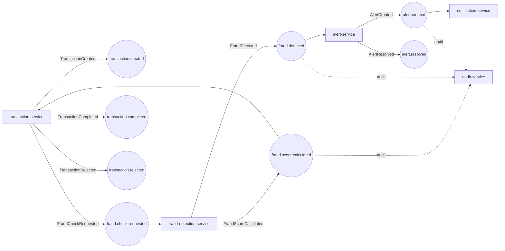

# Avro schemas & event contracts

Every asynchronous message on Kafka is an **Avro** record with a schema registered
in the **Confluent Schema Registry**. Avro gives us a compact binary wire format
and, crucially, **schema evolution** — producers and consumers can be deployed
independently as long as each change stays compatible.

- **Schemas:** 8 `.avsc` files in [`libs/avro-schemas/src/main/avro/`](../libs/avro-schemas/src/main/avro)
- **Namespace:** `com.frauddetect.avro.events` (all records)
- **Topic constants:** [`libs/common/.../constants/KafkaTopics.java`](../libs/common/src/main/java/com/frauddetect/common/constants/KafkaTopics.java)
- **Subject strategy:** default `TopicNameStrategy` → subject = `<topic>-value`
- **Registration:** `AUTO_REGISTER_SCHEMAS=true` (producers register on first send)
- **Compatibility:** registry global level **BACKWARD** (`SCHEMA_REGISTRY_SCHEMA_COMPATIBILITY_LEVEL=backward` in [docker-compose](../deploy/docker/docker-compose.yml) and [k8s schema-registry](../deploy/k8s/infra/schema-registry.yaml))

## Schema → topic → subject

| # | Schema | Topic | Subject | Produced in the flow by |
|---|--------|-------|---------|--------------------------|
| 1 | `TransactionCreated`   | `transaction.created`    | `transaction.created-value`    | transaction-service |
| 2 | `FraudCheckRequested`  | `fraud.check.requested`  | `fraud.check.requested-value`  | transaction-service |
| 3 | `FraudScoreCalculated` | `fraud.score.calculated` | `fraud.score.calculated-value` | fraud-detection-service |
| 4 | `FraudDetected`        | `fraud.detected`         | `fraud.detected-value`         | fraud-detection-service |
| 5 | `AlertCreated`         | `alert.created`          | `alert.created-value`          | alert-service |
| 6 | `AlertResolved`        | `alert.resolved`         | `alert.resolved-value`         | alert-service |
| 7 | `TransactionCompleted` | `transaction.completed`  | `transaction.completed-value`  | transaction-service |
| 8 | `TransactionRejected`  | `transaction.rejected`   | `transaction.rejected-value`   | transaction-service |

See [`kafka.md`](kafka.md) for the full producer/consumer/consumer-group topology and the dead-letter topics.

## Event flow

## Common envelope

Every event carries the same four leading fields, so any consumer can log, trace,
and order events uniformly:

| Field | Type | Meaning |
|-------|------|---------|
| `eventId` | `string` | Unique id for this event instance (dedup / idempotency) |
| `correlationId` | `string` | Propagated across the whole request chain (REST → Kafka → gRPC); ties events, traces, and logs together |
| `occurredAt` | `long` / `timestamp-millis` | Event time (→ `java.time.Instant`) |
| domain ids | `string` | `transactionId` / `accountId` / `customerId` / `alertId` as applicable |

## Type conventions

- **Money** is `bytes` / `decimal(19,4)` → `java.math.BigDecimal` (never a float — no rounding drift). `enableDecimalLogicalType=true`.
- **Timestamps** are `timestamp-millis` → `java.time.Instant`.
- **Enum-like fields** (`type`, `severity`, `decision`, `status`, `channel`, `resolution`, `reasonCode`) are plain **`string`**, not Avro `enum`. This is deliberate: a new severity/decision value on the producer side never breaks an older consumer's deserialization. The domain enums live in Java (`FraudSeverity`, `Decision`, `AlertStatus`, …) and validate on read.
- **Optional fields** are unions `["null", T]` with `default null` — the pattern that keeps additions BACKWARD-compatible.

## Field reference

<b>Transaction domain</b>

**TransactionCreated** — emitted when a transaction is accepted for processing.
`eventId, correlationId, occurredAt, transactionId, accountId, customerId, amount(decimal), currency, type, merchantId?, merchantCategory?, countryCode, city?, latitude?, longitude?, deviceId?, ipAddress?, channel="WEB"`

**FraudCheckRequested** — transaction-service asks for a verdict.
`eventId, correlationId, occurredAt, transactionId, accountId, customerId, amount(decimal), currency, type, countryCode, merchantId?, merchantCategory?, deviceId?, ipAddress?, latitude?, longitude?`

**TransactionCompleted** — terminal success (score attached).
`eventId, correlationId, occurredAt, transactionId, accountId, customerId, amount(decimal), currency, fraudScore(int), severity`

**TransactionRejected** — terminal rejection.
`eventId, correlationId, occurredAt, transactionId, accountId, customerId, reasonCode, reason, fraudScore?(int), severity?`

<b>Fraud domain</b>

**FraudScoreCalculated** — the scoring result (drives the transaction outcome).
`eventId, correlationId, occurredAt, transactionId, customerId, accountId, score(int), severity, decision, modelRiskScore?(double), triggeredRules[]` where each `TriggeredRule` = `{ ruleCode, description, weight(int), score(int) }`.

**FraudDetected** — raised only when the verdict warrants an alert.
`eventId, correlationId, occurredAt, transactionId, customerId, accountId, score(int), severity, decision, primaryReason, triggeredRuleCodes, amount(decimal), currency, countryCode`

<b>Alert domain</b>

**AlertCreated** — a case opened for investigation.
`eventId, correlationId, occurredAt, alertId, transactionId, customerId, accountId, severity, score(int), status="OPEN", title, description, assignedTo?`

**AlertResolved** — an investigator closed the case.
`eventId, correlationId, occurredAt, alertId, transactionId, customerId, resolution, resolvedBy, notes?, caseId?`

## Code generation

`SpecificRecord` Java classes are generated at build time — no hand-written POJOs.
Declared in [`libs/avro-schemas/pom.xml`](../libs/avro-schemas/pom.xml)
(`avro-maven-plugin`, version `1.12.0` from the root `<pluginManagement>`), bound to
`generate-sources`:

| Setting | Value |
|---------|-------|
| `sourceDirectory` | `src/main/avro` |
| `outputDirectory` | `target/generated-sources/avro` |
| `stringType` | `String` |
| `enableDecimalLogicalType` | `true` (→ `BigDecimal`) |
| `fieldVisibility` | `PRIVATE` |

Downstream services depend on the `avro-schemas` module and use the generated classes
directly with `KafkaAvroSerializer` / `KafkaAvroDeserializer` (`specific.avro.reader=true`).

## Evolution rules (BACKWARD)

BACKWARD compatibility means **a new schema can read data written with the old
schema** — so you upgrade **consumers first**, then producers. In practice:

| Change | Allowed under BACKWARD? |
|--------|--------------------------|
| Add a field **with a default** (e.g. `["null",T] = null`) | ✅ |
| Remove a field | ✅ (readers ignore it) |
| Add a field **without a default** | ❌ |
| Rename a field / change its type | ❌ (use add-new + deprecate) |

Because enum-like values are plain strings, adding a new `severity`/`decision`
value is a **data** change, not a **schema** change — it never triggers a
compatibility break. New consumers must still handle unknown string values
gracefully (the domain enums do).

To verify a proposed change before shipping, POST the new `.avsc` to the registry's
`/compatibility/subjects/<subject>/versions/latest` endpoint.
