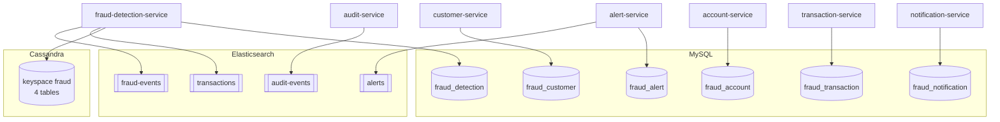

# Data stores — polyglot persistence

The platform uses **three** stores, each for what it's best at, and every service
owns its own data (no shared database, no cross-service SQL joins). Cross-entity
references (`customer_id`, `account_id`, …) are **logical only** — there are no SQL
`FOREIGN KEY` constraints between services, just indexes.

| Store | Role | Used by |
|-------|------|---------|
| **MySQL** (Flyway) | authoritative transactional state (OLTP) | customer, account, transaction, fraud-detection, alert, notification |
| **Cassandra** | high-write, query-first behavioural history & velocity | fraud-detection only |
| **Elasticsearch** | search & analytics, Kibana dashboards | fraud-detection, alert, audit |

`risk-scoring-service` and `api-gateway` are **stateless** — they own no store.

## MySQL — authoritative state (Flyway)

One database per owning service. DDL is owned entirely by **Flyway** (`V1__*.sql`
migrations); Hibernate runs with `ddl-auto: validate`, so the JPA entities and the
migrated schema must agree or the service refuses to start. The six databases (and
a shared `fraud` app user) are pre-created by
[`deploy/docker/mysql/init/01-init.sh`](../deploy/docker/mysql/init/01-init.sh);
Flyway then creates the tables on first boot. All tables are InnoDB / utf8mb4 with
a JPA `@Version` optimistic-lock column.

| Service | Database | Core table(s) | Migration |
|---------|----------|---------------|-----------|
| customer | `fraud_customer` | `customers`, `users` | [`V1__init_customer_schema.sql`](../services/customer-service/src/main/resources/db/migration/V1__init_customer_schema.sql) |
| account | `fraud_account` | `accounts` | [`V1__init_account_schema.sql`](../services/account-service/src/main/resources/db/migration/V1__init_account_schema.sql) |
| transaction | `fraud_transaction` | `transactions`, `idempotency_keys`, `processed_events` | [`V1__init_transaction_schema.sql`](../services/transaction-service/src/main/resources/db/migration/V1__init_transaction_schema.sql) |
| fraud-detection | `fraud_detection` | `fraud_rules`, `processed_events` | [`V1__init_fraud_detection.sql`](../services/fraud-detection-service/src/main/resources/db/migration/V1__init_fraud_detection.sql) |
| alert | `fraud_alert` | `alerts`, `processed_events` | [`V1__init_alert_schema.sql`](../services/alert-service/src/main/resources/db/migration/V1__init_alert_schema.sql) |
| notification | `fraud_notification` | `notifications`, `processed_events` | [`V1__init_notification_schema.sql`](../services/notification-service/src/main/resources/db/migration/V1__init_notification_schema.sql) |

Key design points:

- **Money** is always `DECIMAL(19,4)` — never a float.
- **Credentials** live only in `customers`/`users` (`fraud_customer`): `users.password_hash` is BCrypt, `email`/`username` are `UNIQUE`. See [`security.md`](security.md).
- **Idempotency & dedupe tables** back the reliability story:
  - `idempotency_keys` (transaction) — one row per client `Idempotency-Key` header, so a retried POST returns the same transaction instead of creating a second.
  - `processed_events` (PK `event_id`) — every Kafka consumer records handled event ids here and skips duplicates. This is the DB half of the effectively-once pipeline in [`kafka.md`](kafka.md#idempotency--effectively-once).
- **The fraud rule engine is data, not code.** `fraud_rules` is seeded with **9 rules** (one per `RuleType`): `LARGE_AMOUNT`, `RAPID_VELOCITY`, `IMPOSSIBLE_TRAVEL`, `SUSPICIOUS_COUNTRY` (high-risk list in `params_json`), `UNUSUAL_FREQUENCY`, `REPEATED_FAILURES`, `ABNORMAL_MERCHANT`, `SUSPICIOUS_DEVICE`, `MODEL_RISK`. Each row carries a `weight`, an `enabled` flag, and thresholds — analysts tune them over REST and the engine reloads, no redeploy.

## Cassandra — query-first behavioural store

Only **fraud-detection-service** uses Cassandra, for the write-heavy, read-in-one-shot
data the scorer needs per transaction. Schema lives in a single CQL file,
[`schema.cql`](../services/fraud-detection-service/src/main/resources/cassandra/schema.cql),
keyspace **`fraud`** (`SimpleStrategy` RF 1 for dev — switch to
`NetworkTopologyStrategy` RF ≥ 3 in prod).

Tables are modelled **query-first**: partition on `(customer_id, day_bucket)`,
cluster by `event_time DESC` so "the customer's last N events" is a single-partition
sequential read, and each table sets a **TTL** for automatic retention.

| Table | Partition key | Clustering | TTL | Answers |
|-------|---------------|-----------|-----|---------|
| `customer_behavior` | `customer_id` | — | none | rolling per-customer profile (counts, 30-day avg, known countries/devices/merchants, last location) — point read + in-place upsert |
| `transaction_velocity` | `(customer_id, day_bucket)` | `event_time DESC, transaction_id ASC` | 7 days | last-hour / last-24h velocity windows |
| `fraud_features` | `(customer_id, day_bucket)` | `event_time DESC, transaction_id ASC` | 90 days | the exact feature vector + verdict, for audit / model replay |
| `historical_activity` | `(customer_id, day_bucket)` | `event_time DESC, transaction_id ASC` | 365 days | chronological per-customer history |

**Schema management differs by profile.** Default (local dev):
`schema-action: CREATE_IF_NOT_EXISTS`. **docker/k8s profile:
`schema-action: NONE`** — the driver never creates schema; the CQL file is applied
by the Cassandra init step (`cqlsh -f schema.cql`), keeping clustering order and TTL
authoritative in the file rather than inferred from entities.

## Elasticsearch — search & analytics

Four indices, written with the **modern typed Java client** (`co.elastic.clients`) —
never the deprecated High Level REST Client.

| Index | Written by | Time field |
|-------|-----------|------------|
| `transactions` | fraud-detection | `occurredAt` |
| `fraud-events` | fraud-detection | `occurredAt` |
| `alerts` | alert | `createdAt` |
| `audit-events` | audit | `occurredAt` |

Each owning service ships an `ElasticsearchIndexInitializer` (an `ApplicationRunner`)
that on startup checks `indices().exists()` and, if absent, creates the index from a
bundled mapping under `resources/elasticsearch/*-index.json`. It is **best-effort and
idempotent** — existing indices are left untouched, and if ES is unreachable the
service still boots (search/analytics degrade, the core pipeline doesn't). Mappings
are explicit (keyword / text+keyword / date / numeric) so term filters and range
queries work rather than relying on dynamic mapping. These indices back the Kibana
dashboards in [`deploy/kibana`](../deploy/kibana) — see [`observability.md`](observability.md).

## Schema management at a glance

| Store | Who creates schema | When | Idempotent? |
|-------|--------------------|------|-------------|
| MySQL | Flyway `V1__*` migrations (DBs by init script) | service startup | yes (Flyway history) |
| Cassandra | `schema.cql` via init (`NONE` in docker) / driver (`CREATE_IF_NOT_EXISTS` in dev) | before/at startup | yes |
| Elasticsearch | `ElasticsearchIndexInitializer` from JSON mappings | service startup | yes (exists-check) |
