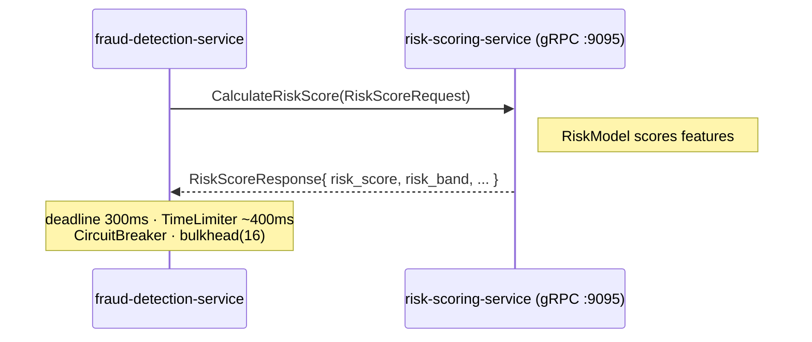

# gRPC / Protobuf — internal synchronous scoring

Most service-to-service communication on this platform is **asynchronous** (Kafka).
The one exception is the **hot path** that must block: when a transaction is being
decided, `fraud-detection-service` needs a model risk sub-score *now*, as part of a
single request/response, to produce an immediate ALLOW / REVIEW / BLOCK verdict.
That call is **gRPC** — a bounded, low-latency, strongly-typed RPC — to
`risk-scoring-service`.

- **Contract:** [`libs/proto-contracts/src/main/proto/risk_scoring.proto`](../libs/proto-contracts/src/main/proto/risk_scoring.proto) (`proto3`)
- **Proto package:** `frauddetect.risk.v1`
- **Generated Java package:** `com.frauddetect.grpc.risk` (`java_multiple_files = true`, outer class `RiskScoringProto`)
- **Server:** `risk-scoring-service` — gRPC on port **9095**, management/HTTP on 8085
- **Client:** `fraud-detection-service` — the only gRPC client
- **RPC:** `RiskScoringService.CalculateRiskScore` — a single **unary** call (no streaming anywhere)

## Why gRPC here and Kafka everywhere else

| | gRPC (this call) | Kafka (everything else) |
|---|------------------|--------------------------|
| Interaction | request/response, **caller blocks** | fire-and-forget event |
| Coupling | temporal (both up at once) | decoupled in time |
| Need | an immediate score to decide the transaction | propagate facts, fan out work |
| Failure mode | **degrade** — proceed rule-only | retry + DLT |

The `.proto` file header documents this rationale inline.

## Service definition

```protobuf
service RiskScoringService {
  rpc CalculateRiskScore(RiskScoreRequest) returns (RiskScoreResponse);
}
```



## Messages

**RiskScoreRequest** — `correlation_id`, `transaction_id`, `customer_id`, `account_id`, `features (TransactionRiskFeatures)`.

**TransactionRiskFeatures** — 15 flat scalar features:
`amount(double)`, `currency`, `transaction_type`, `country_code`, `merchant_category`,
`tx_count_last_hour(int64)`, `tx_count_last_24h(int64)`, `amount_sum_last_24h(double)`,
`avg_amount_last_30d(double)`, `distinct_countries_last_24h(int64)`,
`new_device(bool)`, `new_merchant(bool)`, `failed_tx_last_hour(int64)`,
`km_from_last_tx(double)`, `seconds_since_last_tx(int64)`.

**RiskScoreResponse** — `transaction_id`, `risk_score(double, 0.0–1.0)`,
`risk_band(string LOW|MEDIUM|HIGH|CRITICAL)`, `contributing_factors[](string)`,
`model_version(int32)`, `scored_at(google.protobuf.Timestamp)`.

No enums, no `oneof`; one `repeated` field (`contributing_factors`).

## Server wiring (`risk-scoring-service`)

No Spring Boot gRPC starter — the server is hand-rolled on core `grpc-java`:

- [`RiskScoringServiceImpl`](../services/risk-scoring-service/src/main/java/com/frauddetect/risk/grpc/RiskScoringServiceImpl.java) — `@Component` extending the generated `RiskScoringServiceImplBase`; delegates to `RiskModel`. Returns `INVALID_ARGUMENT` when `!request.hasFeatures()`, `INTERNAL` on runtime failure.
- [`GrpcServerRunner`](../services/risk-scoring-service/src/main/java/com/frauddetect/risk/grpc/GrpcServerRunner.java) — a Spring `SmartLifecycle` that builds the `io.grpc.Server`, auto-binds every `BindableService` bean plus **health** (`HealthStatusManager`) and **reflection** (`ProtoReflectionServiceV1`), and installs the `CorrelationServerInterceptor`.
- Config via `GrpcServerProperties`: `grpc.server.port` (`GRPC_PORT`, default 9095), `max-inbound-message-bytes: 4194304`, `shutdown-grace-seconds: 15`.

Health + reflection being on means you can probe it with `grpcurl`:

```bash
grpcurl -plaintext localhost:9095 list
grpcurl -plaintext localhost:9095 grpc.health.v1.Health/Check
```

## Client wiring (`fraud-detection-service`)

- [`GrpcClientConfig`](../services/fraud-detection-service/src/main/java/com/frauddetect/fraud/config/GrpcClientConfig.java) — one long-lived `ManagedChannel` (`forAddress(host,port)`, `.usePlaintext()` when configured, `CorrelationClientInterceptor`), exposing a `RiskScoringServiceBlockingStub` bean.
- [`RiskScoringProperties`](../services/fraud-detection-service/src/main/java/com/frauddetect/fraud/config/RiskScoringProperties.java) — `@ConfigurationProperties("risk.grpc")` → `risk.grpc.{host,port,deadline-ms,plaintext}`. Defaults: host `localhost` (docker profile: `risk-scoring-service`), port `9095`, `deadline-ms 300`, `plaintext true`.

### Resilience (all in [`RiskScoringClient`](../services/fraud-detection-service/src/main/java/com/frauddetect/fraud/client/RiskScoringClient.java))

The call is wrapped so a slow or dead scorer never blocks a transaction decision:

| Layer | Setting |
|-------|---------|
| gRPC deadline | `withDeadlineAfter(300ms)` |
| **TimeLimiter** `riskScoring` | timeout ≈ `deadlineMs + 100` (~400ms), `cancelRunningFuture=true` |
| **Bulkhead** | fixed 16-thread `riskScoringExecutor` (bounds concurrent calls) |
| **CircuitBreaker** `riskScoring` | COUNT_BASED window 20, `minimumNumberOfCalls=10`, `failureRateThreshold=50%`, `waitDurationInOpenState=10s`, `permittedNumberOfCallsInHalfOpenState=3` |

Composition: `CircuitBreaker.decorateCallable(cb, TimeLimiter.decorateFutureSupplier(...))`
run through Vavr `Try.ofCallable(...)`.

**Graceful degradation — no fallback score.** On timeout, error, or open circuit
(`CallNotPermittedException`), `onDegraded(...)` logs, increments `fraud.risk.degraded`,
and the `Try` yields an **empty `Optional`**. The fraud engine then proceeds
**rule-only** — the `MODEL_RISK` rule simply doesn't fire. A risk-scorer outage
degrades scoring quality; it never blocks the pipeline. Metrics: `fraud.risk.calls`,
`fraud.risk.degraded`.

The client consumes **only `risk_score`** from the response today; `risk_band`,
`contributing_factors`, `model_version`, and `scored_at` are reserved for future use.

## Build — protobuf-maven-plugin

[`libs/proto-contracts/pom.xml`](../libs/proto-contracts/pom.xml) runs
`protobuf-maven-plugin 0.6.1` with two goals — `compile` (messages) and
`compile-custom` (gRPC stubs) — using downloaded, pinned toolchain binaries so no
local `protoc` install is required:

| Coordinate | Version |
|------------|---------|
| `protoc` | `com.google.protobuf:protoc:4.29.3` |
| gRPC codegen | `io.grpc:protoc-gen-grpc-java:1.71.0` |
| classifier | `${os.detected.classifier}` via `os-maven-plugin 1.7.1` |

The module also pulls `org.apache.tomcat:annotations-api` (provided) to supply
`javax.annotation.Generated` for the generated stubs on modern JDKs.
