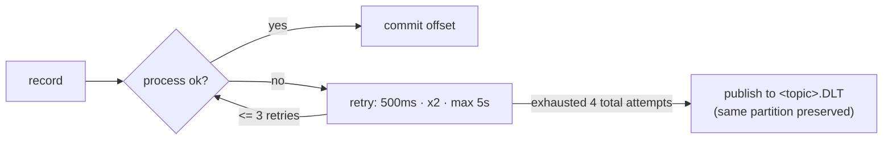

# Kafka messaging layer

All asynchronous, decoupled communication flows over Kafka using **Avro** values
(see [`avro.md`](avro.md)) and the **Confluent Schema Registry**. Five services take
part; four don't touch Kafka at all.

- **Topic name constants:** [`libs/common/.../constants/KafkaTopics.java`](../libs/common/src/main/java/com/frauddetect/common/constants/KafkaTopics.java)
- **Header constants:** [`libs/common/.../constants/Headers.java`](../libs/common/src/main/java/com/frauddetect/common/constants/Headers.java)
- **Kafka-active services:** transaction, fraud-detection, alert, notification, audit
- **Not on Kafka:** api-gateway, customer-service, account-service, risk-scoring-service (gRPC-only)
- **Keying:** every producer keys by **`customerId`** (`StringSerializer` key, `KafkaAvroSerializer` value) — so all events for one customer land on the same partition and stay ordered.

## Topics

| Topic | Producer | Consumer → group | Avro value |
|-------|----------|-------------------|------------|
| `transaction.created`    | transaction | fraud-detection → `fraud-detection`; audit → `audit-service` | `TransactionCreated` |
| `transaction.completed`  | transaction | audit → `audit-service` | `TransactionCompleted` |
| `transaction.rejected`   | transaction | audit → `audit-service` | `TransactionRejected` |
| `fraud.score.calculated` | fraud-detection | transaction → `transaction-service`; audit → `audit-service` | `FraudScoreCalculated` |
| `fraud.detected`         | fraud-detection | alert → `alert-service`; audit → `audit-service` | `FraudDetected` |
| `alert.created`          | alert | notification → `notification-service`; audit → `audit-service` | `AlertCreated` |
| `alert.resolved`         | alert | audit → `audit-service` | `AlertResolved` |
| `fraud.check.requested`  | *(none)* | audit → `audit-service` | `FraudCheckRequested` |

> **`fraud.check.requested` is intentionally reserved** — it has a constant and an
> Avro schema and audit is wired to record it, but nothing produces it today. The
> transaction → fraud hand-off happens via `transaction.created` (fraud-detection
> consumes that directly). The topic is kept for a future explicit check-request path.

Producers: `TransactionEventProducer`, `FraudEventProducer`, `AlertEventProducer`
(each under its service's `.../messaging/`). Listeners: `FraudScoreListener`
(transaction), `TransactionCreatedListener` (fraud), `FraudDetectedListener` (alert),
`AlertCreatedListener` (notification), and audit's single `AuditEventListener`
(one `@KafkaListener` across all eight topics).

## Flow

```mermaid
flowchart LR
  subgraph tx[transaction-service]
  end
  subgraph fd[fraud-detection-service]
  end
  subgraph al[alert-service]
  end
  subgraph no[notification-service]
  end
  subgraph au[audit-service]
  end

  tx -->|transaction.created| fd
  fd -->|fraud.score.calculated| tx
  fd -->|fraud.detected| al
  al -->|alert.created| no

  tx -. transaction.created/completed/rejected .-> au
  fd -. fraud.score.calculated/detected .-> au
  al -. alert.created/resolved .-> au
```

The solid edges are the operational pipeline; the dotted edges are audit's
fan-in (it subscribes to everything and writes an append-only trail — see
[`security.md`](security.md#audit-logging)).

## Delivery guarantees

**Producers** (identical config in every `config/KafkaConfig.java`):

- `acks=all`, `enable.idempotence=true`, `max.in.flight.requests.per.connection=5`, `retries=Integer.MAX_VALUE`
- **Not** Kafka-transactional. Exactly-once is *approximated* by idempotent producer + deterministic event ids + consumer-side dedupe (below), not by `transactional.id`.
- transaction-service publishes from a `@TransactionalEventListener(phase = AFTER_COMMIT)` — an **outbox-style** guarantee that the event fires only after the DB row commits, never before.

**Consumers:**

- `enable.auto.commit=false`, `isolation.level=read_committed`, `auto.offset.reset=earliest`, `specific.avro.reader=true`
- Container ack mode **`AckMode.RECORD`** — offset committed after each record is processed successfully.
- Listener concurrency defaults to **1** thread per listener (not tuned; raise via `setConcurrency` / `spring.kafka.listener.concurrency` for throughput).

## Retries & dead-letter topics

Every consuming service uses the same policy, hard-coded in its `KafkaConfig`
error handler:



- `ExponentialBackOffWithMaxRetries(3)` → **3 retries / 4 total attempts**, initial `500ms`, multiplier `2.0`, cap `5000ms`.
- `DefaultErrorHandler` + `DeadLetterPublishingRecorder` route the poison record to **`<topic>.DLT`** (`KafkaTopics.dlt(...)`), preserving the original partition index.
- DLTs are **quarantine only** — no service consumes any `.DLT`. Inspect and replay them manually.

## Idempotency → effectively-once

The pipeline is at-least-once (redelivery on retry/rebalance is possible), made
**effectively-once** by two mechanisms working together:

1. **Deterministic event ids.** When a consumer re-emits a downstream event, it derives the new `eventId` via `EventIds.derive(inboundEventId, kind)` — a UUIDv3 of `<inboundEventId>:<kind>`. Redelivery of the same input therefore produces the **same** output `eventId`.
2. **Dedupe on write.** Each consuming service records handled ids in a `processed_events` table (PK `event_id`) and skips duplicates; alert uses the alert PK; Elasticsearch docs are keyed by `eventId` (idempotent upsert). See [`database.md`](database.md).

So a duplicate delivery re-computes the same ids and no-ops on the DB/ES write.

## Correlation propagation

- Every event's Avro envelope carries `correlationId` (and `eventId`, `occurredAt`). Consumers restore it via `CorrelationContext.setCorrelationId(event.getCorrelationId())` and clear MDC in a `finally` — so logs and traces stitch together across the whole chain.
- Producers *also* stamp an `X-Correlation-Id` Kafka header, but consumers read the **Avro field**, not the header (the header is redundant for in-app propagation, kept for external tooling).
- At the REST edge, `CorrelationIdFilter` + `CorrelationContext` seed the id (accepting an inbound one or minting a fresh UUID).

## Topic provisioning

Only two `KafkaTopicsConfig` classes declare `NewTopic` beans, each owning the
topics it produces plus the DLT of the topic it consumes — all **3 partitions,
RF 1** (RF 1 is the dev single-broker default; raise for prod):

- **transaction-service:** `transaction.created`, `transaction.completed`, `transaction.rejected`, `fraud.score.calculated.DLT`
- **fraud-detection-service:** `fraud.score.calculated`, `fraud.detected`, `transaction.created.DLT`

Everything else (`alert.*`, `fraud.check.requested`, and the remaining DLTs)
relies on **broker auto-create** — the dev broker sets
`KAFKA_AUTO_CREATE_TOPICS_ENABLE=true` (single-node KRaft, see
[`deploy/k8s/infra/kafka.yaml`](../deploy/k8s/infra/kafka.yaml)). For production,
pre-create every topic with an explicit partition count and RF ≥ 3 and turn
auto-create off.

## Schema Registry

- URL from `spring.kafka.properties.schema.registry.url` — `localhost:8090` (local dev host mapping) / `http://schema-registry:8081` (docker/k8s in-network).
- `auto.register.schemas=true`; subjects follow `TopicNameStrategy` = `<topic>-value`; global compatibility **BACKWARD**. Full detail in [`avro.md`](avro.md).
