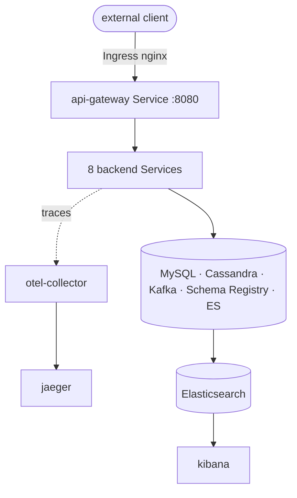

# Kubernetes deployment

Manifests to run the whole platform on a local cluster (kind / minikube / k3d).
Everything is under [`deploy/k8s`](../deploy/k8s) and uses **GA APIs only**:
`apps/v1`, `v1`, `batch/v1`, `networking.k8s.io/v1`, `autoscaling/v2`, `policy/v1`.

> The bundled `infra/` (MySQL, Cassandra, Kafka, Schema Registry, Elasticsearch,
> Kibana, Jaeger, OTel Collector) is **single-node dev/demo only**. In production,
> run stateful backends via operators or managed services and deploy only the
> application workloads + networking. For OpenShift, see [`openshift.md`](openshift.md).

## Layout

| Path | Contents |
|------|----------|
| `namespace.yaml` | `fraud-detection` namespace (Pod Security Admission `warn: restricted`) |
| `config.yaml` | `platform-config` ConfigMap + `platform-secrets` Secret (dev-only placeholders) |
| `apps/` | Deployment + Service per service (9) |
| `infra/` | Dev single-node backing services |
| `networking/` | Ingress, HPA, PodDisruptionBudgets, NetworkPolicies |
| `kustomization.yaml` | Ties it together + generates 3 file-based ConfigMaps |
| `apply.sh` / `delete.sh` | Turnkey apply / teardown |

## One profile for compose *and* k8s

Every service runs with `SPRING_PROFILES_ACTIVE=docker` (set in `platform-config`).
The `docker` profile hardcodes in-cluster DNS hostnames — `mysql`, `kafka`,
`cassandra`, `schema-registry`, `elasticsearch`, `otel-collector`,
`risk-scoring-service` — which **exactly match the Service names** in this
namespace. So there is no separate `kubernetes` profile to maintain: the same
profile that wires Docker Compose wires Kubernetes. Only `JWT_SECRET`, `MYSQL_USER`,
`MYSQL_PASSWORD`, and customer-service's `ADMIN_*` come from `platform-secrets`.



## Topology & scaling

- **api-gateway:** 2 replicas, HPA 2→5 @ 70% CPU.
- **transaction-service:** HPA 2→6; **fraud-detection-service:** HPA 2→8 (the ingest/scoring hot path). Others scale manually via `replicas`.
- **PodDisruptionBudgets** keep minimum availability during voluntary disruptions; **HPAs** need `metrics-server`.
- Scale-down is damped (`stabilizationWindowSeconds: 300`) to avoid flapping.

## Security posture

Every application pod (from the manifests + [OpenShift-safe images](#images)):

- `runAsNonRoot: true`, UID **1001**, group **0**, `seccompProfile: RuntimeDefault`
- `readOnlyRootFilesystem: true` (only a `/tmp` `emptyDir` is writable)
- all Linux capabilities **dropped**, `allowPrivilegeEscalation: false`
- `automountServiceAccountToken: false`

**NetworkPolicies** (`networking/network-policy.yaml`) implement a namespace
perimeter: default-deny ingress, allow free east-west traffic within the namespace,
and allow external traffic to **only** `api-gateway:8080`. (Requires a
policy-enforcing CNI such as Calico or Cilium.)

Probes hit Actuator: `startupProbe` → `/actuator/health` (30×5s grace for slow first
boot), `readinessProbe` → `/actuator/health/readiness`, `livenessProbe` →
`/actuator/health/liveness`.

## Images

The manifests reference `frauddetect/<svc>:1.0.0` (`imagePullPolicy: IfNotPresent`).
Each service has a multi-stage Dockerfile — `eclipse-temurin:21-jdk` build (reactor
build via the Maven wrapper, `-pl <svc> -am`) → `eclipse-temurin:21-jre` runtime,
non-root UID 1001 / group 0, `chmod g=u` (arbitrary-UID / OpenShift safe). Build and
load into the cluster (needs **JDK 21** — see [`technology-versions.md`](technology-versions.md)):

```bash
for s in api-gateway customer-service account-service transaction-service \
         fraud-detection-service risk-scoring-service alert-service \
         notification-service audit-service; do
  docker build -f "services/$s/Dockerfile" -t "frauddetect/$s:1.0.0" .
  kind load docker-image "frauddetect/$s:1.0.0"     # minikube: minikube image load ...
done
```

## Deploy

```bash
cd deploy/k8s && ./apply.sh
```

or directly with kustomize — note the load-restrictor flag (the ConfigMap
generators read canonical files *outside* `deploy/k8s`: the same MySQL init script
and OTel config the compose stack uses, plus the fraud service's `schema.cql`):

```bash
kustomize build --load-restrictor=LoadRestrictionsNone deploy/k8s | kubectl apply -f -
```

Watch it come up (infra becomes healthy first; a `cassandra-schema-init` Job applies
`schema.cql`; then services pass startup probes):

```bash
kubectl -n fraud-detection get pods -w
```

## Access

Point `/etc/hosts` at your ingress IP (e.g. `127.0.0.1` for kind):

```
127.0.0.1  fraud.local kibana.fraud.local jaeger.fraud.local
```

| URL | What |
|-----|------|
| `http://fraud.local/api/v1/auth/login` | Obtain a JWT (public) |
| `http://fraud.local/api/v1/...` | Platform API via the gateway |
| `http://kibana.fraud.local` | Kibana |
| `http://jaeger.fraud.local` | Jaeger traces |

Or port-forward without an ingress:

```bash
kubectl -n fraud-detection port-forward svc/api-gateway 8080:8080
```

## Prerequisites

- A cluster + `kubectl` context; images built and loaded (above).
- `metrics-server` (for HPAs), an `ingress-nginx` controller (for the Ingress).
- Elasticsearch may need `vm.max_map_count=262144` on the node.

## Teardown

```bash
cd deploy/k8s && ./delete.sh
```

Secrets in `config.yaml` are **dev-only placeholders** — replace with a real secrets
manager before any shared use (see [`security.md`](security.md#8-secrets-hygiene)).
