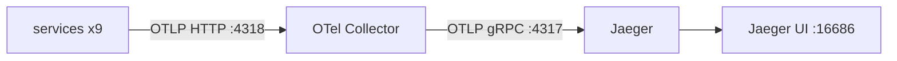
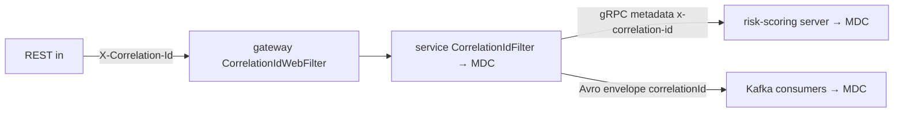

# Observability

Every service is instrumented across the **three pillars** — metrics, traces, and
structured logs — and all three are stitched together by a single **correlation id**
that follows a request across REST, gRPC, and Kafka.

| Pillar | Tech | Where it goes |
|--------|------|---------------|
| Metrics | Micrometer → Prometheus | `/actuator/prometheus` (scrape) |
| Traces | Micrometer Tracing → OTLP | OTel Collector → Jaeger |
| Logs | Spring Boot 4 structured logging (ECS JSON) | stdout → Elasticsearch → Kibana |

## Health & Actuator

Every service exposes the same `management` surface: endpoints `health, info,
prometheus, metrics` (the gateway adds `gateway`). Health **probe groups** are
enabled (`management.endpoint.health.probes.enabled: true`), giving Kubernetes:

| Probe | Path |
|-------|------|
| startup / liveness | `/actuator/health/liveness` |
| readiness | `/actuator/health/readiness` |
| aggregate | `/actuator/health` |

`show-details: always` everywhere except customer-service (`when_authorized`, since
it's the identity service). The k8s manifests wire `startupProbe` (30×5s grace for
slow first boot) + `readinessProbe` + `livenessProbe` to these paths.

## Metrics

Micrometer with `micrometer-registry-prometheus` in every service. Scrape path
**`/actuator/prometheus`**; a common tag `application=${spring.application.name}` is
attached to every meter so you can slice by service. Alongside the JVM/HTTP/Kafka
defaults, the platform emits domain meters:

| Meter | Meaning |
|-------|---------|
| `fraud.analysis` (timer) | end-to-end scoring latency (p50/p95/p99) |
| `fraud.detections` | count of HIGH/CRITICAL detections |
| `fraud.risk.calls` / `fraud.risk.degraded` | gRPC scoring calls / degraded (breaker/timeout) |
| `fraud.es.index.failures` / `alert.es.index.failures` | best-effort ES indexing misses |
| `resilience4j.circuitbreaker.*` | risk-scoring breaker state/rates |
| `alert.resolved` | alerts resolved |
| `audit.events.indexed` / `audit.events.index.failures` | audit trail throughput |

## Tracing

`micrometer-tracing-bridge-otel` + `opentelemetry-exporter-otlp` in every service,
**sampling at 100%** (`management.tracing.sampling.probability: 1.0` — fine for
dev/demo; lower it in production). Spans export over OTLP HTTP to the collector,
which batches and forwards to Jaeger:

- Export endpoint: env `MANAGEMENT_OTLP_TRACING_ENDPOINT`, default
  `http://localhost:4318/v1/traces`, docker/k8s → `http://otel-collector:4318/v1/traces`.
- Collector config [`deploy/docker/otel-collector-config.yaml`](../deploy/docker/otel-collector-config.yaml): OTLP receivers on HTTP `:4318` / gRPC `:4317`, `memory_limiter` + `batch` processors, Jaeger exporter to `jaeger:4317`.

> **Known quirk:** customer-service reads `OTEL_EXPORTER_OTLP_ENDPOINT` instead of
> `MANAGEMENT_OTLP_TRACING_ENDPOINT`. Both defaults point at the collector, so tracing
> works; just set both env vars if you relocate the collector. Noted in
> [`troubleshooting.md`](troubleshooting.md).

## Correlation IDs

One id ties a request's logs, traces, and events together. MDC key **`correlationId`**
(`CorrelationContext.MDC_KEY`); wire header **`X-Correlation-Id`** (`Headers`). It is
read-or-minted at the edge and propagated across every transport:

| Transport | Mechanism |
|-----------|-----------|
| REST (servlet) | `CorrelationIdFilter` (`OncePerRequestFilter`, auto-registered by `CommonWebAutoConfiguration`) — reads/mints, binds MDC, echoes on response |
| Gateway (reactive) | `CorrelationIdWebFilter` (`WebFilter`, `HIGHEST_PRECEDENCE`) — preserves/mints, forwards, echoes |
| gRPC | metadata key `x-correlation-id` — client interceptor copies MDC→metadata, server interceptor metadata→MDC |
| Kafka | producers stamp the `X-Correlation-Id` header **and** embed `correlationId` in the Avro envelope; consumers restore from the Avro field, clear MDC in `finally` |

## Structured logging

Uses Spring Boot 4's **built-in** structured logging — `logging.structured.format.console:
ecs` emits **ECS JSON** to stdout. There is deliberately **no `logback-spring.xml`**
anywhere; it's enabled only in the **docker** profile (local/default logs stay
human-readable plain text). ECS records carry `@timestamp`, `log.level`, `message`,
`service.name`, thread/process, the MDC `correlationId`, and `trace.id`/`span.id`
(populated by Micrometer Tracing) — so in Kibana you can pivot from a log line to
its trace and filter a whole request chain by `correlationId`.

## Dashboards

Pre-built Kibana **data views, saved searches, visualizations, and two dashboards**
("Fraud Operations", "Audit & Security") ship in
[`deploy/kibana`](../deploy/kibana). Import with `deploy/kibana/import-saved-objects.sh`
after the stack is up. They read the four Elasticsearch indices described in
[`database.md`](database.md#elasticsearch--search--analytics).

## Quick access (local/docker)

| UI | URL |
|----|-----|
| Prometheus scrape (any service) | `http://localhost:<port>/actuator/prometheus` |
| Jaeger traces | `http://localhost:16686` |
| Kibana | `http://localhost:5601` |
| Health | `http://localhost:<port>/actuator/health` |
