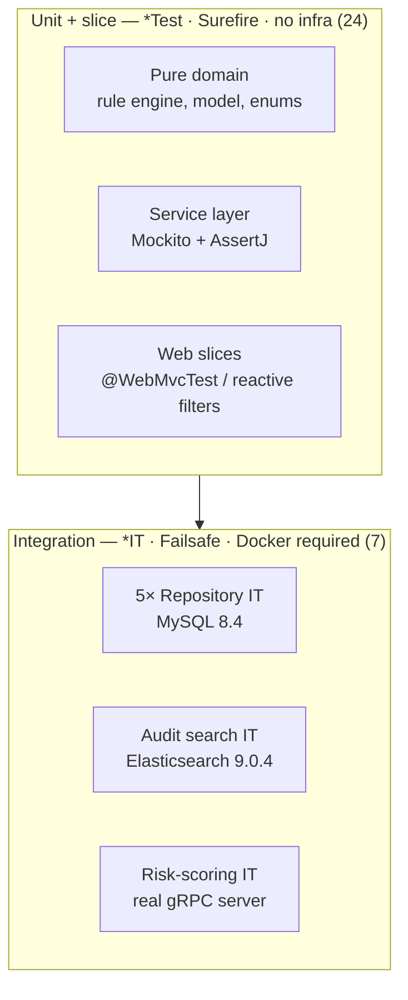

# Testing

The suite is a deliberate **pyramid**: many fast in-JVM unit and slice tests, and a
focused band of integration tests that run against **real backing services in
Testcontainers** — never mocks of the database, the search engine, or the gRPC
transport. **31 test classes** span every module.



## Frameworks

All inherited transitively from `spring-boot-starter-test` (no versions pinned by
hand — the Boot 4.1.0 parent curates them), plus the Testcontainers BOM:

| Tool | Use |
|------|-----|
| **JUnit 5** (Jupiter) | test engine; `@ParameterizedTest` for boundary/table-driven cases |
| **Mockito** | collaborator mocking in service-layer unit tests; `@MockitoBean` in web slices |
| **AssertJ** | fluent assertions everywhere (`assertThat(...)`) |
| **Spring Boot test slices** | `@WebMvcTest` (servlet controllers), `@DataJpaTest` (repositories) |
| **Spring Security test** | `@WithMockUser` to assert RBAC on real security chains |
| **Testcontainers** | `MySQLContainer`, `ElasticsearchContainer` — real infra for `*IT` |
| **JaCoCo** 0.8.12 | coverage (`prepare-agent` + `report`, aggregated unit + IT) |

> Modern idioms only: tests use **`@MockitoBean`** (`org.springframework.test.context.bean.override.mockito`),
> not the removed Spring Boot `@MockBean`; the ES integration test drives the modern
> **`co.elastic.clients`** typed client, not the deprecated High Level REST Client.

## The naming convention *is* the execution boundary

| Suffix | Runner | Phase | Infra |
|--------|--------|-------|-------|
| `*Test` | Surefire | `test` | none — pure JVM, mocks |
| `*IT` | **Failsafe** | `integration-test` / `verify` | **a running Docker daemon** |

This split is wired in the reactor [`pom.xml`](../pom.xml): the `maven-failsafe-plugin`
binds `integration-test`+`verify`, so `./mvnw test` runs only the fast tests while
`./mvnw verify` additionally runs the Testcontainers ITs. JaCoCo's single
`prepare-agent` feeds both Surefire and Failsafe, so the `verify`-phase report
aggregates unit **and** integration coverage.

## Unit & slice tests (24)

Four recurring shapes:

- **Pure domain — no Spring, no mocks.** `FraudSeverityTest` pins the score→severity
  boundaries (0–29 LOW / 30–59 MEDIUM / 60–79 HIGH / 80–100 CRITICAL);
  [`FraudRuleEngineTest`](../services/fraud-detection-service/src/test/java/com/frauddetect/fraud/engine/FraudRuleEngineTest.java)
  + `RuleEvaluatorsTest` exhaustively table-test each rule (large-amount, velocity,
  impossible-travel, …), weighting, aggregation, and the severity/decision mapping —
  the "brain" is the most heavily covered unit in the codebase.
- **Service layer with Mockito.** `AuthServiceTest` (BCrypt encode/verify, duplicate
  handling), `AccountServiceTest`, `TransactionServiceTest`, `AlertServiceTest`,
  `NotificationServiceTest` — repositories/producers mocked, behaviour asserted with
  AssertJ. Kafka listeners are unit-tested too (`FraudDetectedListenerTest`,
  `AlertCreatedListenerTest`) with the service mocked.
- **Servlet web slices — `@WebMvcTest`.** e.g.
  [`AccountControllerTest`](../services/account-service/src/test/java/com/frauddetect/account/web/AccountControllerTest.java)
  `@Import`s the **real** `SecurityConfig` + `GlobalExceptionHandler`, mocks only the
  service with `@MockitoBean`, and drives `MockMvc` with `@WithMockUser(roles=...)`.
  So one test file proves the happy path, **401** unauthenticated, **403** wrong-role
  (real `@PreAuthorize`), **400** bean-validation, and **404** mapping — the actual
  security + error contract, not a stub of it.
- **Reactive gateway filters.** `RateLimitingWebFilter`, `JwtAuthenticationWebFilter`,
  `CorrelationIdWebFilter` are tested with `MockServerWebExchange` + a hand-rolled
  `WebFilterChain` (no running server): token-bucket exhaustion → **429**+`Retry-After`,
  per-IP isolation, 401-without-proxy, header strip/forward, correlation mint/echo.

## Integration tests — Testcontainers (7)

Real infra, spun up per test class, torn down after. **Requires Docker.**

| IT | Container | Proves |
|----|-----------|--------|
| `TransactionRepositoryIT` | MySQL **8.4** | JPA mapping, constraints, queries |
| `AccountRepositoryIT` | MySQL 8.4 | " |
| `CustomerRepositoryIT` | MySQL 8.4 | " (users/customers) |
| `AlertRepositoryIT` | MySQL 8.4 | " |
| `NotificationRepositoryIT` | MySQL 8.4 | " |
| [`AuditSearchServiceIT`](../services/audit-service/src/test/java/com/frauddetect/audit/search/AuditSearchServiceIT.java) | Elasticsearch **9.0.4** | ES index/search round-trip |
| `RiskScoringServiceImplIT` | — (real gRPC server) | end-to-end gRPC call |

**Repository ITs** follow one pattern (see
[`TransactionRepositoryIT`](../services/transaction-service/src/test/java/com/frauddetect/transaction/repository/TransactionRepositoryIT.java)):
`@DataJpaTest` + `@AutoConfigureTestDatabase(replace = NONE)` + `@Testcontainers`, a
static `MySQLContainer("mysql:8.4")`, `@DynamicPropertySource` wiring the JDBC URL,
Hibernate `create-drop`, Flyway disabled in the slice — the schema is exercised
against the *same MySQL version the platform ships*, not H2.

**`AuditSearchServiceIT`** pins the container to the client version
(`elasticsearch:9.0.4`) for wire compatibility, builds the **modern**
`ElasticsearchClient` over `RestClientTransport`, applies the real
`ElasticsearchIndexInitializer` mapping, then asserts the behaviours that only a real
engine reveals: `term` filters resolving against `keyword` fields, full-text over
`summary`, correlation-id fan-in, and — critically — that **re-indexing the same
`eventId` overwrites rather than duplicates** (the effectively-once guarantee from
[`kafka.md`](kafka.md#idempotency--effectively-once), verified end-to-end).

## Running

```bash
./mvnw test        # unit + slice only — fast, no Docker
./mvnw verify      # + Testcontainers ITs + JaCoCo report — needs Docker
```

Per-module: `./mvnw -pl services/fraud-detection-service verify`. Coverage reports
land at `target/site/jacoco/` in each module.

> **Build prerequisite:** the reactor requires **JDK 21** (enforced by
> `maven-enforcer-plugin`; see [`technology-versions.md`](technology-versions.md)).
> On a JDK < 25 toolchain the build fails at the enforcer before any test runs — this
> is the one environmental gate to clear first. See [`troubleshooting.md`](troubleshooting.md).
>
> The Failsafe/JaCoCo wiring described here is standard reactor configuration; it has
> **not** been executed in this authoring environment (JDK 21 unavailable locally), so
> run `./mvnw verify` on a JDK-21 machine with Docker to confirm the full suite green.
