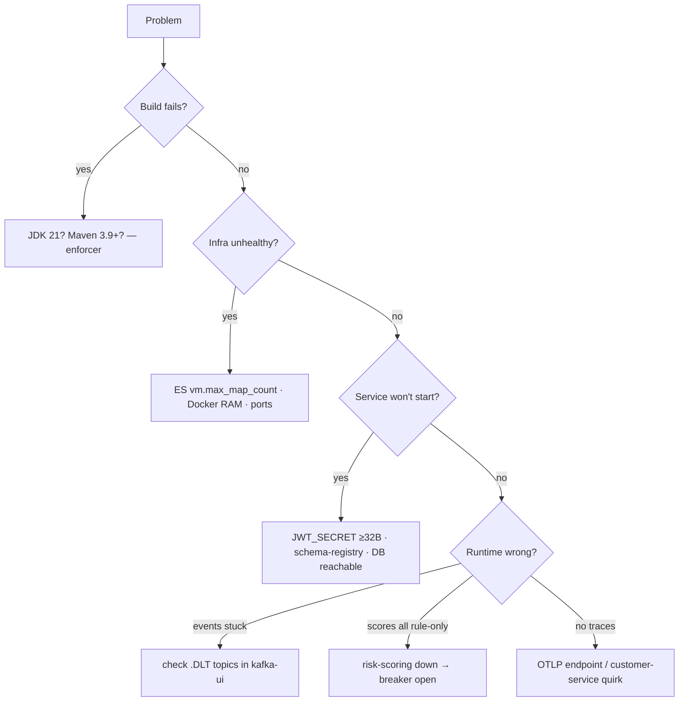

# Troubleshooting

A symptom-first guide to the things that actually bite when standing this platform up.
Ordered roughly by when you hit them: **build → infra → runtime → deploy**.



## Build

**`mvn`/enforcer fails immediately: "Java 21+ is required".**
The reactor enforces **JDK 21** (`maven-enforcer-plugin`, `requireJavaVersion [21,)`)
and **Maven 3.9.0+**. This is the single most common blocker. Check `java -version`;
point `JAVA_HOME` at a JDK 21 build. There is no workaround short of installing
JDK 21 — the enforcer runs before compilation by design (see
[`technology-versions.md`](technology-versions.md)).

**Enforcer fails on a dependency version** (`alpha/beta/rc/milestone` banned, or
`SNAPSHOT` banned, or duplicate versions). The version policy is mechanical — pin a
GA release. See [`technology-versions.md`](technology-versions.md).

**`kafka-avro-serializer` / `kafka-schema-registry-client` won't resolve.** They're
hosted on the **Confluent** repository, not Maven Central — it's declared in the root
`pom.xml`. Behind a proxy/mirror, allow `packages.confluent.io` or mirror it.

**Integration tests don't run / "no Docker".** `*IT` classes run under Failsafe in
`./mvnw verify` and need a **Docker daemon**. `./mvnw test` skips them. See
[`testing.md`](testing.md).

## Infrastructure (Docker Compose)

**Elasticsearch container exits / bootstrap check fails.** Set the host kernel param:

```bash
sudo sysctl -w vm.max_map_count=262144      # persist in /etc/sysctl.conf
```

On Docker Desktop this applies to the VM; a restart of the ES container after setting
it usually clears it. Also give Docker enough RAM (ES + Kafka + Cassandra + MySQL is
memory-hungry — 8 GB+ recommended).

**A service boots before its database/broker is ready.** Compose gates every service
with health-checked `depends_on`, so start-up is ordered
(`cd deploy/docker && docker compose up -d`). If you start a single service manually,
bring up infra first and wait for `docker compose ps` to show healthy.

**Cassandra: keyspace/tables missing.** The `cassandra-init` one-shot applies
`schema.cql` (keyspace `fraud`). In the `docker` profile the app uses
`schema-action: NONE` — it does **not** create tables itself. If init didn't run,
re-run it or apply `schema.cql` with `cqlsh`. On k8s the `cassandra-schema-init` Job
does this.

## Port & endpoint quick-reference

| Thing | Host port | Note |
|-------|-----------|------|
| api-gateway | 8080 | the only public entry |
| services | 8081–8088 | see [`architecture.md`](architecture.md#service-catalog) |
| risk-scoring gRPC | 9095 | internal only |
| **Schema Registry** | **8090** | container listens on 8081 — **host maps 8090** |
| Kafka UI | 8100 | inspect topics **and `.DLT`** |
| Kibana | 5601 | dashboards |
| Jaeger UI | 16686 | traces |
| Elasticsearch | 9200 | |
| OTel Collector | 4318 (HTTP) / 4317 (gRPC) | |

> **Gotcha:** connecting a local tool to Schema Registry uses `localhost:8090`, but
> *inside* the compose/k8s network services use `http://schema-registry:8081`. Don't
> mix them.

## Runtime

**Service fails to start: "JWT secret must be at least 32 bytes".** `JwtService`
enforces a ≥32-byte `JWT_SECRET` at startup (HS256). Set a real secret; the dev
default is a clearly-labelled placeholder. See [`security.md`](security.md#1-token-issuance).

**Everything logs a warning about the admin password.** `customer-service` bootstraps
a default ADMIN and **warns loudly** if `ADMIN_PASSWORD` is still `admin-change-me`.
Set `ADMIN_USERNAME`/`ADMIN_PASSWORD` (and `JWT_SECRET`) via `.env` (compose) or
`platform-secrets` (k8s).

**401 on every call.** The gateway strips inbound `X-User-*` and requires a valid
`Bearer` token on non-public paths. Get one from `POST /api/v1/auth/login`; public
paths are `/api/v1/auth/**` and `/actuator/**` only. **403** instead means
authenticated but wrong role — check the endpoint→role table in
[`security.md`](security.md#3-authorization-rbac).

**429 Too Many Requests.** The gateway token-bucket limiter (~100 req/min/IP) tripped
— it sits *before* auth. Tune `GATEWAY_RATE_LIMIT_*` or wait for `Retry-After`.

**Events produced but never processed; consumer lag stuck.** The record probably
exhausted its retries (3×, exponential 500ms→5s) and landed on the **`<topic>.DLT`**
topic. Inspect DLTs in Kafka UI (`localhost:8100`); the failure cause is on the
record headers. See [`kafka.md`](kafka.md#retries--dead-letter-topics).

**Producer/consumer errors mentioning schema incompatibility.** Registry compatibility
is global **BACKWARD**. An Avro change that isn't backward-compatible is rejected at
registration. Follow the evolution rules in [`avro.md`](avro.md#schema-evolution).

**All fraud scores look "rule-only" / `fraud.risk.degraded` climbing.** The gRPC call
to `risk-scoring-service` is failing, so the circuit breaker opened and scoring
**degrades gracefully to rule-only** (by design — not an outage of fraud detection).
Check risk-scoring-service health on `:8085/actuator/health` and that
fraud-detection-service can reach it on `:9095`. See
[`grpc.md`](grpc.md#resilience).

**No traces in Jaeger.** Traces flow service → OTel Collector (`:4318`) → Jaeger.
Verify the collector is up and `MANAGEMENT_OTLP_TRACING_ENDPOINT` points at it.
**Known quirk:** `customer-service` reads **`OTEL_EXPORTER_OTLP_ENDPOINT`** instead —
if only that service is missing traces, set that variable. See
[`observability.md`](observability.md#tracing).

**Duplicate side effects on redelivery.** There shouldn't be any — consumers dedupe
via `ProcessedEvent` and ES docs are keyed by `eventId`. If you see duplicates,
confirm the `processed_events` table exists (Flyway ran) and the consumer isn't
committing before processing. See [`kafka.md`](kafka.md#idempotency--effectively-once).

## Kubernetes / OpenShift

**`kustomize build` errors: "security; file is not in or below the base dir".**
The ConfigMap generators intentionally read canonical files *outside* `deploy/k8s`
(shared MySQL init, OTel config, `schema.cql`). Build with:

```bash
kustomize build --load-restrictor=LoadRestrictionsNone deploy/k8s | kubectl apply -f -
```

**Pods `ImagePullBackOff`.** Images are `frauddetect/<svc>:1.0.0` with
`imagePullPolicy: IfNotPresent` and are **not** on a public registry — build and load
them (`kind load docker-image ...` / `minikube image load ...`), or push to your
registry. See [`kubernetes.md`](kubernetes.md#images).

**HPA shows `<unknown>` targets.** Install `metrics-server`.

**East-west traffic blocked / services can't talk.** NetworkPolicies default-deny
ingress and need a policy-enforcing CNI (Calico/Cilium); on a CNI that ignores
policies they're simply inert. See [`kubernetes.md`](kubernetes.md#security-posture).

**OpenShift: app pods won't admit / SCC errors.** The app manifests are
`restricted-v2`-clean *after* the overlay strips `runAsUser`/`fsGroup`. Deploy via
`deploy/openshift` (not `deploy/k8s`) so those patches apply. The bundled **dev infra**
is *not* SCC-clean — run it only in a throwaway project (`anyuid`) or replace it with
operators. See [`openshift.md`](openshift.md#-dev-infra-on-openshift).

## Still stuck?

- Every service exposes `/actuator/health` (with `readiness`/`liveness` groups) and
  `/actuator/prometheus` — start there.
- Filter logs and traces by the **`correlationId`** that threads a whole request across
  REST, gRPC, and Kafka (see [`observability.md`](observability.md#correlation-ids)).
- Cross-reference the deep-dive docs linked from [`architecture.md`](architecture.md).
